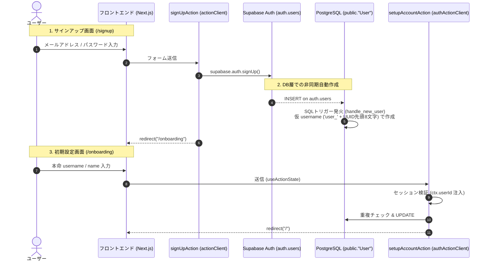

# 認証・オンボーディングフロー仕様 (Auth & Onboarding Flow)

本書では、Supabase Auth と Next.js (Server Actions) を組み合わせた新規登録から初期設定（オンボーディング）、およびプロフィール更新までのライフサイクルと画面遷移の仕様について定義します。

---

## 1. 全体フロー概要

新規登録時の離脱率低減と、データベース整合性の担保を両立するため、**「登録（Auth のみ）」と「初期設定（Profile 設定）」を明確に2段階に分離**したフローを採用しています。



---

## 2. フェーズ別詳細仕様

### Phase 1: サインアップ (`/signup`)
- **目的:** 最小限の入力で最速のアカウント開設を完了させる。
- **入力項目:** メールアドレス、パスワードのみ（`username` や `name` はこの画面では入力させない）。
- **使用クライアント:** `actionClient`（未ログイン状態で実行）。
- **処理:**
  1. Zod で形式バリデーション。
  2. `supabase.auth.signUp()` を実行。
  3. 成功時、トップページではなく `/onboarding` へ強制リダイレクト。

### Phase 2: 自動生成 (Database Trigger)
- **目的:** レースコンディション（競争状態）の完全排除。
- **挙動:** `auth.users` にレコードが挿入された瞬間、SQLトリガーにより `public."User"` に以下の値で即時レコードが作成される。
  - `id`: `auth.users.id`
  - `username`: `'user_' || substr(new.id::text, 1, 8)`（一意性保証）
  - `name`: `'名無しユーザー'`

### Phase 3: オンボーディング (`/onboarding`)
- **目的:** ユーザーのアイデンティティ（表示名と希望のユーザーネーム）の確定。
- **入力項目:** `username`（必須・重複不可）、`name`（必須）。
- **使用クライアント:** `authActionClient`（セッション必須、`ctx.userId` を使用）。
- **処理:**
  1. 重複チェック: 他のユーザーが既にその `username` を取得していないか Prisma で確認。
  2. 更新: `ctx.userId` に一致するレコードの `username` と `name` を `UPDATE`。
  3. 完了後、メイン画面（`/`）へリダイレクト。

---

## 3. アクション実装例

### 1. サインアップ (`src/app/actions/auth.ts`)

```typescript
"use server";

import { actionClient } from "@/lib/safe-action";
import { createClient } from "@/lib/supabase/server";
import { redirect } from "next/navigation";
import { z } from "zod";

const signUpSchema = z.object({
  email: z.string().email("有効なメールアドレスを入力してください"),
  password: z.string().min(8, "パスワードは8文字以上必要です"),
});

export const signUpAction = actionClient
  .inputSchema(signUpSchema)
  .action(async ({ parsedInput }) => {
    const supabase = await createClient();

    const { error } = await supabase.auth.signUp({
      email: parsedInput.email,
      password: parsedInput.password,
    });

    if (error) {
      throw new Error(error.message);
    }

    // 登録成功後はオンボーディングへ誘導
    redirect("/onboarding");
  });
```

### 2. 初期セットアップ (`src/app/actions/onboarding.ts`)

```typescript
"use server";

import { authActionClient } from "@/lib/safe-action";
import { prisma } from "@/lib/prisma";
import { redirect } from "next/navigation";
import { z } from "zod";

const setupAccountSchema = z.object({
  username: z
    .string()
    .min(3, "ユーザーネームは3文字以上必要です")
    .max(15, "ユーザーネームは15文字以内です")
    .regex(/^[a-zA-Z0-9_]+$/, "半角英数字とアンダースコアのみ使用可能です"),
  name: z.string().min(1, "表示名を入力してください").max(50),
});

export const setupAccountAction = authActionClient
  .inputSchema(setupAccountSchema)
  .action(async ({ parsedInput, ctx }) => {
    // 1. username の重複確認（自身以外の重複）
    const existing = await prisma.user.findUnique({
      where: { username: parsedInput.username },
    });

    if (existing && existing.id !== ctx.userId) {
      throw new Error("このユーザーネームは既に使用されています");
    }

    // 2. 確定値で更新
    await prisma.user.update({
      where: { id: ctx.userId },
      data: {
        username: parsedInput.username,
        name: parsedInput.name,
      },
    });

    redirect("/");
  });
```

---

## 4. 将来拡張時のルール（Action の分割原則）

プロフィールの更新処理は、ユースケースごとに責務を分けて作成し、1つの巨大な Action に統合しない方針を徹底します。

1. **オンボーディング (`setupAccountAction`):** 初回のみ。`username` と `name` のセットアップ。
2. **プロフィール編集 (`updateProfileAction`):** 日常的な変更。`name`、`bio`、`avatarUrl` などのみを対象とし、`username` の変更は含めない。
3. **ユーザーネーム変更 (`changeUsernameAction`):** 設定画面専用。URL やメンションの破損を伴うため、警告・再確認フローを挟んだ単独処理として実装する。